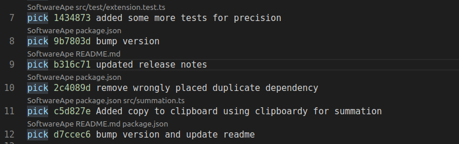

# rebaser

Rebaser helps you with your git interactive rebase needs.

## Code Lenses

View additional commit information in interactive rebase TODO in vscode.



## Keybindings

Use the keys `p`, `r`, `e`, `s`, `f`, `x`, `d` to quickly edit commit commands in the interactive rebase TODO.

## Installation

1. You must have git installed and on your path.
2. For this extension to work you need to register VSCode as your default git editor:
    ```bash
    $ git config --global core.editor 'code --wait'
    ```

## Extension Settings

## Known Issues

## Release Notes

### 0.2.0

Add keybindings for quickly changing pick, fixup, edit, etc. using just the key p, f, e, ... on selected lines.

### 0.1.1

Add icon

### 0.1.0

Initial release of rebaser
